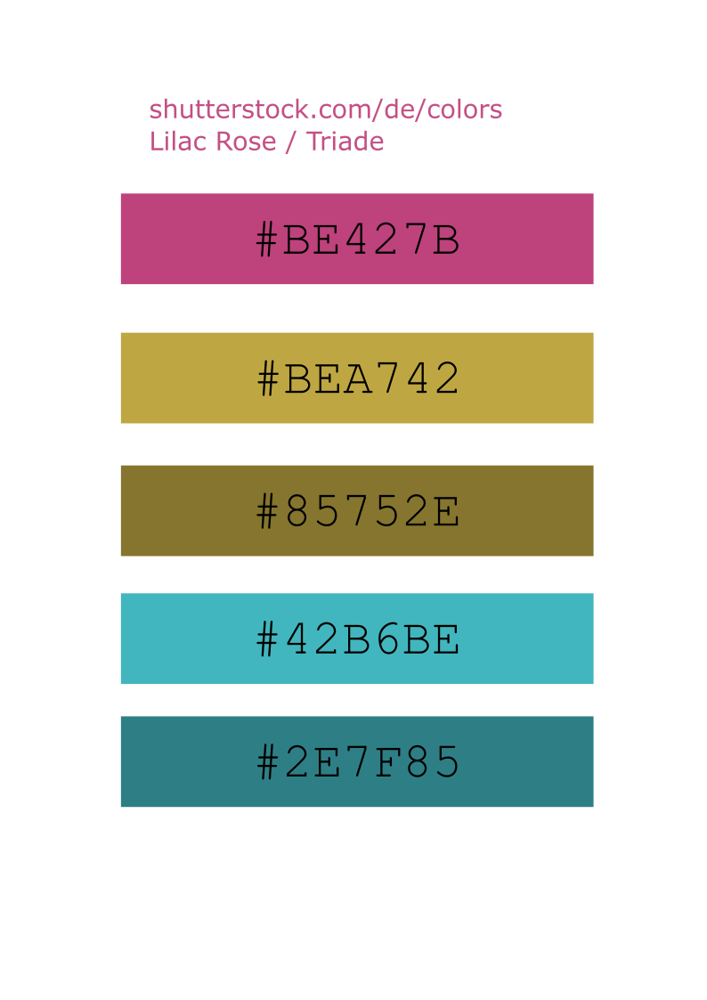

# stadl-color-paletter
STADL color palettes for R

## Background
We have 5 STADL colors:

I now want to have color palettes in R based on the five colors. To do so I follow the article of [Carlos Carlos-Barbacil](https://cano-barbacil.wixsite.com/canobarbacil/post/create-your-own-color-palette-in-r).

